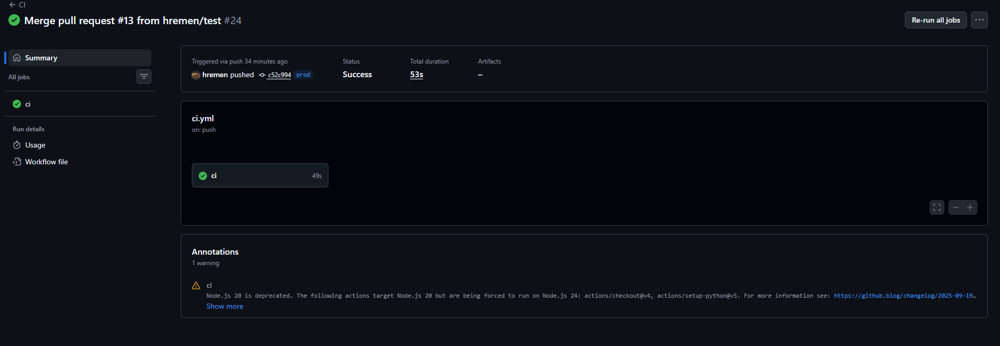
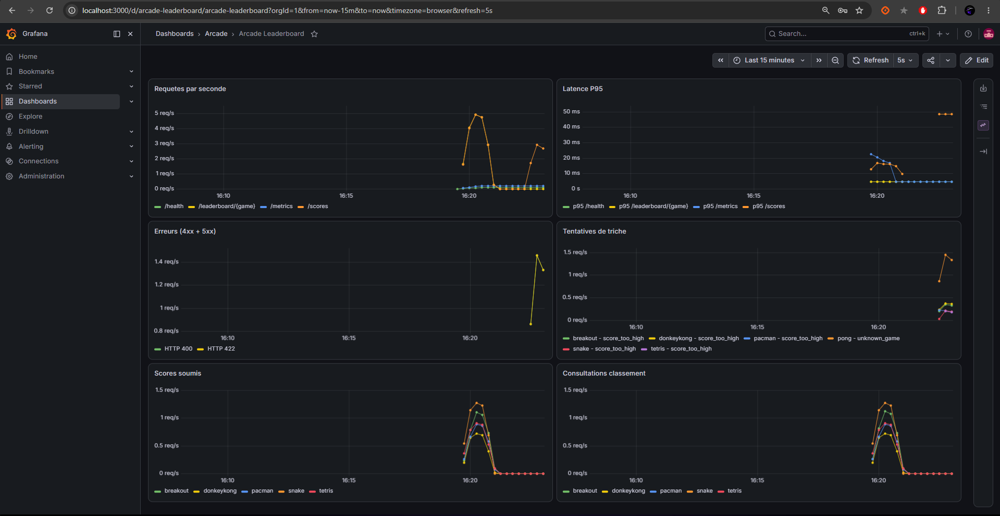
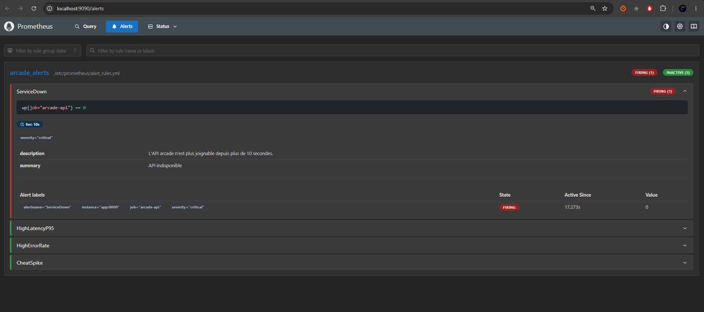

# Retro Arcade Leaderboard — code fourni

Projet realise par **REMEN Hugo** et **WOLF Bryan** — ESI CYB 25-27

Ce dossier contient l'API et les tests unitaires **déjà écrits** pour
l'évaluation Cyber. Voir `Evaluation_Cyber_Arcade_Leaderboard.md` pour
l'énoncé complet et ce qui est attendu de vous.

## Structure du projet

```
ArcadeLeaderboard/
├─ app/                            # API FastAPI (code fourni)
│  ├─ main.py                      # routes HTTP + middleware metriques
│  ├─ business.py                  # logique metier (anti-triche, classement, cooldown)
│  ├─ storage.py                   # persistance SQLite
│  ├─ metrics.py                   # metriques Prometheus
│  ├─ models.py                    # schemas Pydantic
│  └─ games.py                     # referentiel des jeux et scores max
├─ tests/                          # tests fournis (pytest)
│  ├─ test_business.py             # tests unitaires de la logique metier
│  ├─ test_api.py                  # tests d'integration HTTP
│  └─ conftest.py                  # fixture base isolee
├─ prometheus/
│  ├─ prometheus.yml               # scrape de l'API + config alerting
│  └─ alert_rules.yml              # 4 regles d'alerte
├─ alertmanager/
│  └─ alertmanager.yml             # routage des alertes
├─ grafana/
│  ├─ provisioning/
│  │  ├─ datasources/datasource.yml   # datasource Prometheus
│  │  └─ dashboards/dashboard.yml     # provider de dashboards
│  └─ dashboards/arcade.json       # dashboard (trafic, latence, erreurs, triche)
├─ k6/
│  └─ load-test.js                 # test de charge (ramp-up)
├─ k8s/                            # bonus Kubernetes
│  ├─ deployment.yaml              # Deployment + probes readiness/liveness
│  └─ service.yaml                 # Service NodePort
├─ .github/workflows/
│  └─ ci.yml                       # pipeline CI (lint, tests, SAST, deps, Trivy)
├─ Dockerfile                      # multi-stage (dev / prod)
├─ docker-compose.yml              # stack prod (app + monitoring)
├─ docker-compose.override.yml     # surcharge dev (hot-reload, logs debug)
├─ .dockerignore
├─ requirements.txt                # dependances runtime
├─ requirements-dev.txt            # + tests et linter
├─ pyproject.toml                  # config pytest / ruff
└─ README.md
```

## Lancer l'API en local

```bash
python -m venv .venv
source .venv/bin/activate   # .venv\Scripts\activate sous Windows
pip install -r requirements-dev.txt

uvicorn app.main:app --reload
```

L'API écoute par défaut sur `http://127.0.0.1:8000`. La base SQLite est
créée automatiquement dans `data/scores.db` (chemin surchargeable via la
variable d'environnement `DB_PATH`). Documentation interactive (Swagger)
disponible sur `http://127.0.0.1:8000/docs`.

## Tester manuellement (curl)

```bash
curl http://127.0.0.1:8000/health

curl -X POST http://127.0.0.1:8000/scores \
  -H "Content-Type: application/json" \
  -d '{"player": "AAA", "game": "pacman", "score": 123456}'

curl "http://127.0.0.1:8000/leaderboard/pacman?limit=5"
curl http://127.0.0.1:8000/players/AAA
curl http://127.0.0.1:8000/games
curl http://127.0.0.1:8000/metrics
```

## Lancer les tests

```bash
pytest -q
```

## Vérifier le linter

```bash
ruff check .
```

## Structure du code

```
app/
  main.py       # routes FastAPI (câblage HTTP uniquement)
  business.py   # règles métier pures (anti-triche, classement, cooldown)
  storage.py    # persistance SQLite
  metrics.py    # métriques Prometheus
  models.py     # schémas Pydantic
  games.py      # référentiel des jeux et de leur score max
tests/
  test_business.py  # tests unitaires de la logique métier
  test_api.py        # tests d'intégration de la couche HTTP
```

La logique métier (`business.py`) est volontairement indépendante de
FastAPI et de SQLite : c'est ce qui permet de la tester sans monter de
serveur ni de base de données.

---

## Lancer avec Docker

### En prod

```bash
docker compose -f docker-compose.yml up --build -d
```

### En dev (hot-reload)

```bash
docker compose up --build -d
```

En dev, le fichier `docker-compose.override.yml` est charge automatiquement par Docker Compose. Il monte le code source en volume pour le hot-reload et active les logs en mode debug. En prod, le code est copie dans l'image, pas de volume de code, et le conteneur redemarre tout seul s'il plante (`restart: unless-stopped`).

Les scores sont stockes dans une base SQLite sur un volume Docker (`app_data`), donc ils survivent aux redemarrages.

## Difference dev / prod

| | Dev | Prod |
|---|---|---|
| Stage Dockerfile | `development` | `production` |
| Hot-reload | Oui (code monte en volume) | Non (code copie dans l'image) |
| Logs | Debug | Default |
| Restart policy | `no` | `unless-stopped` |
| Deps de test | Installees | Non installees |

## Services

| Service | URL | Login |
|---------|-----|-------|
| API | http://localhost:8000 | - |
| Swagger | http://localhost:8000/docs | - |
| Grafana | http://localhost:3000 | admin / admin |
| Prometheus | http://localhost:9090 | - |
| Alertmanager | http://localhost:9093 | - |

## CI

Le pipeline GitHub Actions (`.github/workflows/ci.yml`) tourne a chaque push sur `prod` et `test` :

1. Lint avec `ruff`
2. Tests avec `pytest` (19 tests)
3. Scan de securite avec `bandit`
4. Scan des dependances avec `pip-audit`
5. Build de l'image Docker
6. Scan de l'image avec Trivy

## Monitoring

Prometheus scrape `/metrics` toutes les 5 secondes. Un dashboard Grafana est provisionne automatiquement avec :

- Requetes par seconde par route
- Latence p95
- Taux d'erreurs (4xx/5xx)
- Tentatives de triche (scores rejetes)
- Scores soumis par jeu
- Consultations du classement

## Alertes

4 alertes dans `prometheus/alert_rules.yml` :

- **ServiceDown** : l'API ne repond plus depuis 10s
- **HighLatencyP95** : latence p95 > 500ms pendant 30s
- **HighErrorRate** : plus de 10% de 5xx pendant 30s
- **CheatSpike** : plus de 5 rejets/s pendant 15s

Pour tester : `docker stop arcade-api` et regarder dans Prometheus > Alerts.

## Test de charge

```bash
k6 run k6/load-test.js
```

Monte de 5 a 50 utilisateurs virtuels sur 90 secondes, on voit l'impact dans Grafana.

## Kubernetes (bonus)

```bash
docker build --target production -t arcade-api .
kind load docker-image arcade-api:latest
kubectl apply -f k8s/
kubectl port-forward svc/arcade-api 8000:8000
```

Probes readiness et liveness sur `/health`.

> Note : le Deployment tourne en `replicas: 1`. La base SQLite est stockee dans un
> volume `emptyDir` propre au pod ; passer a plusieurs replicas donnerait des bases
> independantes (classements incoherents). Pour scaler il faudrait une base partagee
> (hors scope de ce bonus).

## Captures d'ecran

### CI verte
Pipeline GitHub Actions : lint, tests, bandit, pip-audit, build et scan Trivy.



### Dashboard Grafana
Trafic, latence p95, erreurs, tentatives de triche, scores soumis et consultations.



### Alerte declenchee (ServiceDown)
Alerte passee en FIRING apres l'arret de l'API.



## Choix techniques

- **Dockerfile multi-stage** : un stage dev avec les deps de test et le hot-reload, un stage prod minimal.
- **docker-compose.override.yml** : mecanisme natif de Docker Compose pour separer dev et prod.
- **Alertmanager** : pour recevoir les alertes Prometheus, branchable sur mail ou Slack.
- **k6** : simple a ecrire et supporte les stages de ramp-up.
